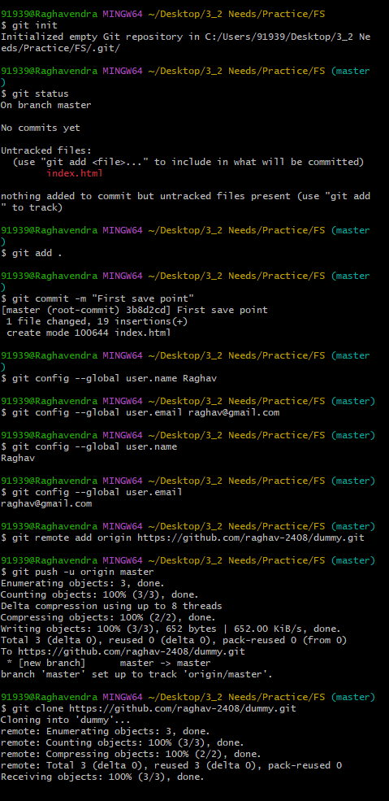

`Note : The programs are not exact out of lab manual`
# Week - 1
```html
<!DOCTYPE html>
<html lang="en">
<head>
    <meta charset="UTF-8">
    <meta name="viewport" content="width=device-width, initial-scale=1.0">
    <title>Document</title>
    <link rel="stylesheet" href="css/bootstrap.min.css">
</head>
<body>
    <div class="jumbotron text-center bg-dark text-white">
        <h1>CMRIT</h1>
        <small>- All departments in CMRIT</small>
        <div class="container-fluid">
            <div class="row">
            <div class="col-md-3 bg-danger">
                <h1>CSD</h1>
                <p>Data Science</p>
                <p>Lorem ipsum dolor, sit amet consectetur adipisicing elit. Voluptatem est mollitia explicabo maxime aliquam perferendis beatae corrupti dolorum molestiae eligendi molestias quibusdam unde dolore vitae impedit quis, a officia! Soluta quas tempora repudiandae unde voluptas repellat voluptatibus consequatur obcaecati ad labore. Inventore ratione ex asperiores!</p>
            </div>
            <div class="col-md-3 bg-primary">
                <h1>CSE</h1>
                <p>Data Science</p>
                <p>Lorem ipsum dolor sit, amet consectetur adipisicing elit. Expedita, ut doloremque unde dolor itaque sint corrupti dicta quod inventore ullam labore molestias saepe ea fuga autem aut recusandae sit facere a, ipsam laborum pariatur consequatur vitae dolore. Expedita iste magnam eius, illum id possimus tempore.</p>
            </div>
            <div class="col-md-3 bg-success">
                <h1>CSM</h1>
                <p>Data Science</p>
                <p>Lorem ipsum dolor sit, amet consectetur adipisicing elit. Expedita, ut doloremque unde dolor itaque sint corrupti dicta quod inventore ullam labore molestias saepe ea fuga autem aut recusandae sit facere a, ipsam laborum pariatur consequatur vitae dolore. Expedita iste magnam eius, illum id possimus tempore.</p>
            </div>
            <div class="col-md-3 bg-secondary ">
                <h1>AIDS</h1>
                <p>Data Science</p>
                <p>Lorem ipsum dolor sit, amet consectetur adipisicing elit. Expedita, ut doloremque unde dolor itaque sint corrupti dicta quod inventore ullam labore molestias saepe ea fuga autem aut recusandae sit facere a, ipsam laborum pariatur consequatur vitae dolore. Expedita iste magnam eius, illum id possimus tempore.</p>
            </div>
        </div>
    </div>
</div>
</body>
</html>
```

# Week - 2

`Note : I haven't added fontawesome icons ! `
```html
<!DOCTYPE html>
<html lang="en">
<head>
    <meta charset="UTF-8">
    <meta name="viewport" content="width=device-width, initial-scale=1.0">
    <title>Document</title>
    <!-- <link rel="stylesheet" href="css/bootstrap.min.css"> -->
    <link href="https://cdn.jsdelivr.net/npm/bootstrap@5.3.3/dist/css/bootstrap.min.css" rel="stylesheet" integrity="sha384-QWTKZyjpPEjISv5WaRU9OFeRpok6YctnYmDr5pNlyT2bRjXh0JMhjY6hW+ALEwIH" crossorigin="anonymous">
    <!-- Bootstrap bundle.min.js is must ! -->
    <script src="https://cdn.jsdelivr.net/npm/bootstrap@5.3.3/dist/js/bootstrap.bundle.min.js" integrity="sha384-YvpcrYf0tY3lHB60NNkmXc5s9fDVZLESaAA55NDzOxhy9GkcIdslK1eN7N6jIeHz" crossorigin="anonymous"></script>

    <style>
        .container nav ul li a{
            color: white;
        }
    </style>
</head>
<body>
     <div class="container-fluid bg-dark">
    <nav class="navbar">
      <ul class="nav">
        <li class="nav-item">
          <a href="#" class="nav-link"><i class="fa fa-home mx-2"></i>Home</a>
        </li>
        <li class="nav-item">
          <a href="#" class="nav-link"><i class="fa fa-address-card mx-2"></i>About</a>
        </li>
        <li class="nav-item">
          <a href="#" class="nav-link"><i class="fa fa-address-book mx-2"></i>Contact</a>
        </li>

        <!-- Dropdown -->
        <li class="dropdown nav-item">
          <a href="#" class="dropdown-toggle nav-link" aria-expanded="true" data-bs-toggle="dropdown">More</a>
          <ul class="dropdown-menu bg-dark">
            <li>
              <a href="#" class="dropdown-item --bs-dark">Item 1</a>
            </li>
            <li>
              <a href="#" class="dropdown-item">Item 2</a>
            </li>
            <li>
              <a href="#" class="dropdown-item">Item 3</a>
            </li>
          </ul>
        </li>
      </ul>
    </nav>
  </div>
</body>
</html>
```

# Week - 3

```
Commands used :
>> npm install '@angular/cli'
>> ng new my-app
>> cd my-app
>> ng serve -open
```

`index.html`
```html
<!doctype html>
<html lang="en">
<head>
  <meta charset="utf-8">
  <title>Week 3</title>
  <base href="/">
  <meta name="viewport" content="width=device-width, initial-scale=1">
  <link href="https://cdn.jsdelivr.net/npm/bootstrap@5.3.3/dist/css/bootstrap.min.css" rel="stylesheet" integrity="sha384-QWTKZyjpPEjISv5WaRU9OFeRpok6YctnYmDr5pNlyT2bRjXh0JMhjY6hW+ALEwIH" crossorigin="anonymous">
  <script src="https://cdn.jsdelivr.net/npm/bootstrap@5.3.3/dist/js/bootstrap.bundle.min.js" integrity="sha384-YvpcrYf0tY3lHB60NNkmXc5s9fDVZLESaAA55NDzOxhy9GkcIdslK1eN7N6jIeHz" crossorigin="anonymous"></script>
  <script src="https://kit.fontawesome.com/66fed9d98a.js" crossorigin="anonymous"></script>
</head>
<body>
  <app-root></app-root>
</body>
</html>
```

`app.component.html`
```html
<!DOCTYPE html>
<html lang="en">
<head>
  <meta charset="UTF-8">
  <meta name="viewport" content="width=device-width, initial-scale=1.0">
  <title>Week 3</title>
</head>
<body>
  <div class="container-fluid bg-dark">
    <nav class="navbar">
      <ul class="nav">
        <li class="nav-item">
          <a href="#" class="nav-link"><i class="fa fa-home mx-2"></i>Home</a>
        </li>
        <li class="nav-item">
          <a href="#" class="nav-link"><i class="fa fa-address-card mx-2"></i>About</a>
        </li>
        <li class="nav-item">
          <a href="#" class="nav-link"><i class="fa fa-address-book mx-2"></i>Contact</a>
        </li>

        <!-- Dropdown -->
        <li class="dropdown nav-item">
          <a href="#" class="dropdown-toggle nav-link" aria-expanded="true" data-bs-toggle="dropdown">More</a>
          <ul class="dropdown-menu bg-dark">
            <li>
              <a href="#" class="dropdown-item --bs-dark">Item 1</a>
            </li>
            <li>
              <a href="#" class="dropdown-item">Item 2</a>
            </li>
            <li>
              <a href="#" class="dropdown-item">Item 3</a>
            </li>
          </ul>
        </li>
      </ul>
    </nav>
  </div>
</body>
</html>
```

# Week - 4

`index.html`

```html
<!DOCTYPE html>
<html lang="en">
<head>
    <meta charset="UTF-8">
    <meta http-equiv="X-UA-Compatible" content="IE=edge">
    <meta name="viewport" content="width=device-width, initial-scale=1.0">
    <title>Moving Cars</title>
    <link rel="stylesheet" href="style.css">
    <body>
    <div class="container">
        <div class="container">
            <div class="road"></div>
              <div class="road-sideview"></div>
                <div class="moving-car">
                    
                </div>
                <div class="car-wheel">
                    
                    
                </div>
              </div>
            </div>
       </div>
    </div>
    </body>
    </html>
```

`style.css`
```css
* {
    margin: 0;
    padding: 0;
}
.container {
    height: 50vh;
    width: 100%;
    background-image: url(sky1.jpg);
    background-size:cover;
    background-position: center;
    position: relative;
    overflow-x: hidden;
} 
.road {
    height: 200px;
    width: 1000%;
    display:block;
    background-image: url(road.jpg);
    position: absolute;
    bottom: 0;
    left: 0;
    right: 0;
    z-index: 1;
    background-repeat: repeat-x;
    animation: road 5s linear infinite;
}
@keyframes road {
    100% {
        transform: translateX(-3500px)  
    }
}
.road-sideview {
    height: 130px;
    width: 1000%;
    background-image: url(city.png);
    position: absolute;
    bottom: 200px;
    left: 0;
    right: 0;
    display: block;
    z-index: 1;
    background-repeat: repeat-x;
    animation: road-sideview 5s linear infinite;
} 

@keyframes road-sideview {
    100% {
        transform: translateX(-1500px);
    }
}
.moving-car {
    width: 500px;
    left: 50%;
    bottom: 50px;
    transform: translateX(-50%);
    position: absolute;
    z-index: 1;
}
.moving-car img {
    width: 90%;
    animation: moving-car 1s linear infinite;
}
@keyframes moving-car {
    100% {
        transform: translateY(-1px);
    }
    50% {
        transform: translateY(1px);
    }
    0% {
        transform: translateY(-1px);
    }
}
.car-wheel {
    left: 50%;
    bottom: 198px;
    transform: translateX(-50%);
    position: absolute;
    z-index: 2;
}
.car-wheel img {
    width: 65px;
    height: 65px;   
    animation: car-wheel .5s linear infinite;
}
@keyframes car-wheel {
    100% {
        transform: rotate(360deg);
    }
}
.car-back-wheel {
    left: -170px;
    position: absolute;
}
.car-front-wheel {
    left: 80px;
    position: absolute;
}
```


# Week - 5

```html
<!DOCTYPE html>
<html lang="en">
<head>
    <meta charset="UTF-8">
    <meta name="viewport" content="width=device-width, initial-scale=1.0">
    <title>Document</title>
    <link rel="stylesheet" href="css/bootstrap.min.css">
</head>

<body>
    <div class="container" onsubmit="validate()">
        <form action="" name="box" class="form-control">
            <fieldset>

                <h1 class="text-center">Registration Form</h1>
                <label for="">First name</label>
                <input name="user" type="text" class="form-control" required>
                <br>
                <label for="">Last name</label>
                <input name="userLast" type="text" class="form-control" required>
                <br>
                <label for="">Password</label>
                <input type="password" name="pass" class="form-control" required>
                <br>
                <label for="">Email</label>
                <input type="email" name="email" class="form-control" required>
                <br>
                <label for="">Date : </label>
                <input type="date" required>
                <br>
                <br>
                <label for="">Gender :</label>
                <label for="Male">Male
                    <input type="radio" name="gender" id="b1" required>
                </label>

                <label for="Female">
                    Female
                    <input type="radio" name="gender" id="b2" required>
                </label>
                <br>
                <br>
                <!-- Direct to next page -->
                <a href="successSubmit">
                    <input type="submit">
                </a>

            </fieldset>
        </form>
        <script>
            function validate() {
                let name = box.user.value;
                //  Traverse through each letter ..
                for (i in name) {
                    ch = name.charCodeAt(i);
                    if (ch < 65 || ch > 90 && ch < 97 || ch > 122) {
                        alert("Invalid Name");
                    }
                }

                // create same for last name ...
                let lastName = box.userLast.value;
                for (i in lastName) {
                    ch = lastName.charCodeAt(i);
                    if (ch < 65 || ch > 90 && ch < 97 || ch > 122) {
                        alert("Invalid Name");
                    }
                }
                // Password length validator
                let pass1 = box.pass.value;
                if (pass1.length < 5) {
                    alert("Should have more than 5 length");
                }

                // Email validator
                let ema = box.email.value;

                // expression :
                let reg = /^[a-zA-Z][a-zA-Z0-9\.-]+@[a-zA-Z].[a-z]{2,4}.[a-z]{2,4}?$/;
                if (reg.test(ema)) {
                    alert("Good to go!");
                }
                else {
                    alert("Invalid mail")
                }
            }
        </script>
    </div>
</body>
</html>
```

# Week - 6

# Note : jQuery CDN link must be placed before Bootstrap.js, not after it, for minimizing the chances of encountering errors like TypeError: $(...).carousel is not a function.

```html
<!DOCTYPE html>
<html lang="en">
<head>
    <meta charset="UTF-8">
    <meta name="viewport" content="width=device-width, initial-scale=1.0">
    <title>Week - 6</title>

    // Bootstrap CSS *must*
    <link rel="stylesheet" href="https://maxcdn.bootstrapcdn.com/bootstrap/3.4.1/css/bootstrap.min.css">

    // JQuery CDN *must*
    <script src="https://code.jquery.com/jquery-3.7.1.min.js"></script>

    //Bootstrap JS *must*
    <script src="https://maxcdn.bootstrapcdn.com/bootstrap/3.4.1/js/bootstrap.min.js"></script>
</head>
<body>
    <div class="container">
        <div id = "myCarousel" class="carousel slide">
            <ol class="carousel-indicators">
                <li class="item1 active"></li>
                <li class="item2"></li>
                <li class="item3"></li>
            </ol>
            <div class="carousel-inner" role = "listbox">
                <div class="item active">
                    
                </div>
                <div class="item">
                    
                </div>
                <div class="item">
                    
                </div>
            </div>
            <a class="left carousel-control" href="#myCarousel" role="button">
                <span class="glyphicon glyphicon-chevron-left" aria-hidden="true"></span>
                <span class="sr-only">Prev</span>
            </a>
            <a class="right carousel-control" href="#myCarousel" role="button">
                <span class="glyphicon glyphicon-chevron-right" aria-hidden="true"></span>
                <span class="sr-only">Next</span>
            </a>
        </div>
    </div>

    <script>
        //JQuery
        $(document).ready(function () {
            $("#myCarousel").carousel();
            $(".item1").click(function () {
                $("#myCarousel").carousel(0);
            })
            $(".item2").click(function () {
                $("#myCarousel").carousel(1);
            })
            $(".item3").click(function () {
                $("#myCarousel").carousel(2);
            })
            $(".left").click(function () {
                $("#myCarousel").carousel("prev");
            })
            $(".right").click(function () {
                $("#myCarousel").carousel("next");
            })
        });
    </script>
</body>
</html>
```

# Week 7

`app.js`

```javascript
const mongoose = require('mongoose');
const express = require('express');
const bodyParser = require('body-parser');
const bcrypt = require('bcrypt');
const app = express();
const user = require('./models/user');
const port = 80;
mongoose.connect("mongodb://localhost:27017/user");
app.set("view engine", "pug");
app.use(bodyParser.json());
app.use(bodyParser.urlencoded({extended : true}));

app.get('/', function(req, res){
    res.render('index');
})

app.get('/Login', function(req, res){
    res.render('Login');
})

app.post('/Login', function(req, res){
    user.findOne({username : req.body.username}, function(err, docs){
        if(err){
            console.log(err);
        }
        else{
            if(docs.username == req.body.username){
                bcrypt.compare(req.body.password, docs.password, function(err, data){
                    if(err){
                        console.log(err);
                    }
                    if(data){
                        console.log(data);
                        res.send("Welcome!");
                    }
                    else{
                        res.send("Invalid Password!");
                    }
                });
            }
        }
    })
})

app.listen(port, ()=>{
    console.log(`app is listening at : http://localhost:${port}`);
})
```

`user.js`

```javascript
const mongoose = require('mongoose');
const Schema = mongoose.Schema;

const userSchema=new Schema({
    username : {type:String},
    password : {type:String},
    age : {type:Number},
    mobile : {type:Number}
    }
);
module.exports=mongoose.model("user",userSchema);
```

`index.pug`
```pug
html 
    head 
        title Login and Register 

    body 
        div(class = "header")
            h1 Login and Register 
            a(href = '/Login') Login
            a(href = '/Register') Register
```

`Login.pug`

```pug
html 
    head 
        title Login Page 
    body 
        div(class = 'container')
            h1 Login  
            include ./index.pug
            form(action = '/Login' method = "post" align = "center")
                label(for = "username") Username 
                input(type = "text" name = "username")

                label(for = "password") Password 
                input(type = "text" name = "password")

                input(type = "submit" value = "Login")
```


# Week 8

`app.js`

```
Note :
1. useNewUrlParser has been depricated and no longer be used.
2. save() doesnot accepts a call back function, instead we can make use of async function and await ! :)) 
```

```javascript
const mongoose = require('mongoose');
const express = require('express');
const bodyParser = require('body-parser');
const bcrypt = require('bcrypt');
const app = express();
const user = require('./models/user');
const port = 80;
mongoose.connect("mongodb://localhost:27017/user");
app.set("view engine", "pug");
app.use(bodyParser.json());
app.use(bodyParser.urlencoded({extended : true}));

app.get('/', function(req, res){
    res.render('index');
})

app.get('/Register', function(req, res){
    res.render('Register');
})

app.post('/Register', async function(req, res){
    try{

        const newUser = new user();
        
        newUser.username = req.body.username;
        
        const salt = bcrypt.genSaltSync(10);
        const hash = bcrypt.hashSync(req.body.password, salt);
        
        newUser.password = hash;
        newUser.age = req.body.age;
        newUser.mobile = req.body.mobile;
        
        const savedUser = await newUser.save(); // Use async/await instead of callback
        console.log(savedUser);
        res.redirect("Login")
    }
    catch(err){
        console.log(err);
    }
})

app.listen(port, ()=>{
    console.log(`app is listening at : http://localhost:${port}`);
})
```

`removed part`

```javascript
newUser.save(function(err, res){
    if(err){
        console.log(err);
    }
    else{
        console.log(res);
        res.redirect("Login")
    }
})
```

`user.js`

```javascript
const mongoose = require('mongoose');
const Schema = mongoose.Schema;

const userSchema=new Schema({
    username : {type:String},
    password : {type:String},
    age : {type:Number},
    mobile : {type:Number}
    }
);
module.exports=mongoose.model("user",userSchema);
```

`index.pug`
```pug
html 
    head 
        title Login and Register 

    body 
        div(class = "header")
            h1 Login and Register 
            a(href = '/Login') Login
            a(href = '/Register') Register
```

`Register.pug`

```pug
html 
    head 
        title Register Page 
    body 
        div(class = 'container')
            h1 Register 
            include ./index.pug
            form(action = '/Register' method = "post" align = "center")
                label(for = "username") Username 
                input(type = "text" name = "username")

                label(for = "password") Password 
                input(type = "text" name = "password")

                label(for = "age") Age 
                input(type = "text" name = "age")

                label(for = "mobile") Mobile 
                input(type = "number" name = "mobile")

                input(type = "submit" value = "Register")
```


``` run on terminal : node app.js ```

# Week 9

`user.js`

```javascript
const mongoose = require('mongoose');
const Schema = mongoose.Schema;
const userSchema = new Schema(
    {
        username: { type: String },
        password: { type: String },
        age: { type: Number },
        mobile: { type: Number }
    }
);

module.exports = mongoose.model("user", userSchema);
```

`magic.js`
```javascript
$(document).ready(function(){
    $("form#change").on('submit', function(e){
        e.preventDefault();
        var data = $('input[name=name]').val();
        $.ajax({
            type: 'post',
            url: '/ajax',
            data: data,
            dataType: 'text'
        })
        .done(function(data){
            $('h1').html(data.name);
        });
    });
});
```

`app.js`

```javascript

const express = require('express');
const bodyparser = require("body-parser")
const bcrypt = require("bcrypt");
const user = require('./models/user');
const mongoose = require('mongoose');
const expressValidator = require("express-validator");
const { check, validationResult } = require('express-validator/check')

const app = express();
// const port = process.env.PORT || 80
const port = 80;
mongoose.connect("mongodb://localhost:27017/user", { userNewUrlParser: true });
app.set('view engine', 'pug');
app.use(bodyparser.json());
app.use(bodyparser.urlencoded({ extended: true }));

//handling get request

app.get('/', function (req, res) {

    res.render('index')
})

app.get('/Login', function (req, res) {

    res.render('Login')
})

app.get('/Register', function (req, res) {
        res.render('Register')
    })

//handling post request

app.post('/Register',
    [
        check('username').not().isEmpty().isLength({ min: 5 }).withMessage('User name must be 5 characters'),
        check('password').not().isEmpty().isLength({ min: 6 }).withMessage('Password name must be 6 characters'),
        check('age').not().isEmpty().isInt().withMessage('age  must be integer'),
        check('mobile').not().isEmpty().isInt().isLength({ min: 10 }).withMessage('mobile number must be number and 10 characters'),
        check('cpassword').custom((value, { req }) => (value === req.body.password)).withMessage("Confirm password not match with your password"),
        check('email').not().isEmpty().isEmail().normalizeEmail().withMessage("Enetr proper email"),
    ],

    function (req, res) {
        const errors = validationResult(req);
        if (!errors.isEmpty()) {
            return res.status(422).jsonp(errors.array());
        }
        else {
            const newUser = new user();
            newUser.username = req.body.username;


            var salt = bcrypt.genSaltSync(10);
            var hash = bcrypt.hashSync(req.body.password, salt);

            newUser.password = hash;
            newUser.age = req.body.age;
            newUser.mobile = req.body.mobile;

            newUser.save(function (err, result) {
                if (err) {
                    console.log(err);
                }
                else {
                    console.log(result);
                    res.redirect("Login");
                }
            })
        }
    })

app.post('/Login', function (req, res) {
    user.findOne({ username: req.body.username }, function (err, docs) {
        if (err) {
            console.log(err)
        }
        else {
            if (docs.username == req.body.username) {
                bcrypt.compare(req.body.password, docs.password, function (err, data) {
                    if (err) {
                        console.log(err);
                    }
                    if (data) {
                        console.log(data);
                        res.send("Welcome");
                    }
                    else {
                        res.send("invalid password");
                    }
                });
            }
            else {
                //res.send("invalid username or password")
                res.redirect("Register");
            }
        }
    })
})


app.get('/ajax', function (req, res) {
    res.render('ajax', { title: 'An Ajax Search', name: "Search user!" });
});
app.post('/ajax', function (req, res) {

    user.findOne({ username: req.body.name }, function (err, docs) {
        if (err) {
            console.log(err)
        }
        else {
            res.render('ajax', { title: 'An Ajax search', name: "Name " + docs.username + ", Age " + docs.age + ", Mobile " + docs.mobile });
        }
    });
});

app.listen(port, () => { console.log(`app is listening on http://localhost:${port}`) })
```

`ajax.pug`

```pug
doctype html
html(lang="en")
    head
        meta(charset="UTF-8")
        meta(http-equiv="X-UA-Compatible", content="IE=edge")
        meta(name="viewport", content="width=device-width, initial-scale=1.0")
        title Login
        style 
            include ./my.css
        script(src="http://code.jquery.com/jquery-3.1.0.min.js")
        script(src="/magic.js")
        include ./index.pug
    body 
        div(class='container')    
            form(method="post" id="change" align="center")
                input(type='text', placeholder='search user', name='name')
                input(type="submit", value="Search")
                br
                a(href="") All 
                a(href="") images 
                a(href="") Latest 
                a(href="") News 
                h1 User Details
                p !{name}
```

`index.pug`

```pug
doctype html
html(lang="en")
    head
        meta(charset="UTF-8")
        meta(http-equiv="X-UA-Compatible", content="IE=edge")
        meta(name="viewport", content="width=device-width, initial-scale=1.0")
        title index page
        style 
            include ./my.css
    body 
        div(class='header')
            h1 Login and Registration APP 
            a(href="/Login") Login 
            a(href="/Register") Register
            a(href="/ajax") Search User
```

`login.pug`

```pug
doctype html
html(lang="en")
    head
        meta(charset="UTF-8")
        meta(http-equiv="X-UA-Compatible", content="IE=edge")
        meta(name="viewport", content="width=device-width, initial-scale=1.0")
        title Login
        style 
            include ./my.css
    body 
        div(class='container')
            include ./index.pug
            h1 Login form
            br
            form(action="/Login" method="post" align="center")
                label(for="username") username
                input(type="text" name="username")
                br
                br
                label(for="password") password
                input(type="password" name="password")
                br
                br
                input(type="submit" name="Login" value="Login")

```

`register.pug`

```pug
doctype html
html(lang="en")
    head
        meta(charset="UTF-8")
        meta(http-equiv="X-UA-Compatible", content="IE=edge")
        meta(name="viewport", content="width=device-width, initial-scale=1.0")
        title Register
        style 
            include ./my.css
    body 
        div(class='container')
            include ./index.pug
            h1 Registration form
            ul(id="errors")
            br
            form(action="/Register" method="post" align="center")
                label(for="username") username
                input(type="text" name="username")
                br
                br
                label(for="password") password
                input(type="password" name="password")
                br
                label(for="cpassword") Confirm password
                input(type="password" name="cpassword")
                br
                br
                label(for="age") user age
                input(type="text" name="age")
                br
                br
                label(for="mobile") user mobile
                input(type="text" name="mobile")
                br
                br
                label(for="email") user email
                input(type="text" name="email")
                br
                br
                input(type="submit" name="Register" value="Register")

```

# Week 10


