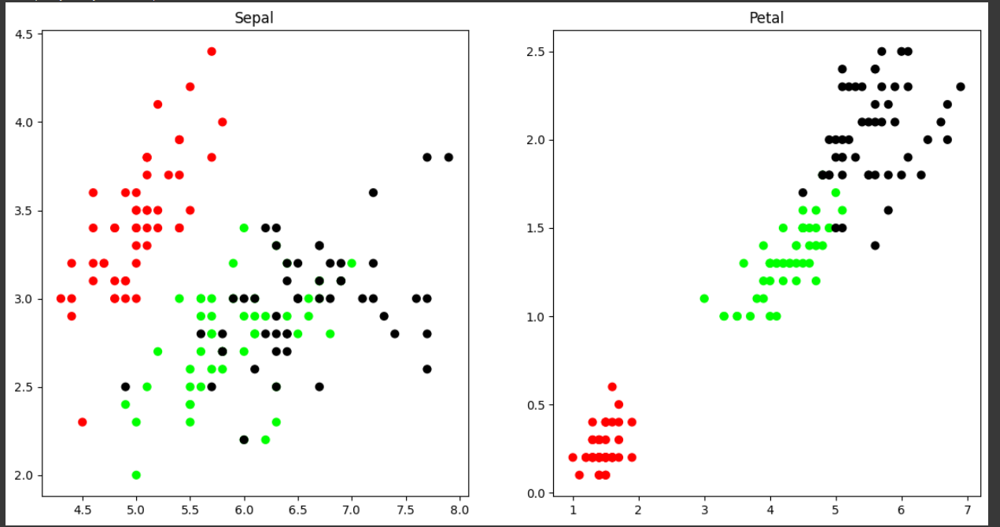
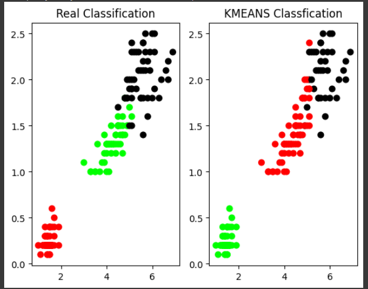
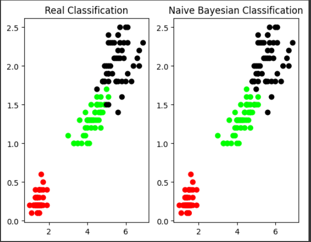

```python
import matplotlib.pyplot as plt
from sklearn import datasets
from sklearn.cluster import KMeans
import sklearn.metrics as sm
import pandas as pd
import numpy as np
iris =datasets.load_iris()
X=pd.DataFrame(iris.data)
print(X.shape)
X.columns=['Sepal_Length','Sepal_Width', 'Petal_length', 'Petal_Width']
y=pd.DataFrame(iris.target)
y.columns=['target']
plt.figure(figsize=(14,10))
colormap=np.array(['red','lime','black'])
plt.subplot(1,2,1)
plt.scatter(X.Sepal_Length,X.Sepal_Width,c=colormap[y.target],s=40)
plt.title('Sepal')
plt.subplot(1,2,2)
plt.scatter(X.Petal_length,X.Petal_Width,c=colormap[y.target],s=40)
plt.title('Petal')
```

`output`

```
(150, 4)
Text(0.5, 1.0, 'Petal')
```



```python
model=KMeans(n_clusters=3)
model.fit(X)
print(model.labels_)
plt.subplot(1,2,1)
plt.scatter(X.Petal_length,X.Petal_Width,c=colormap[y.target],s=40)
plt.title('Real Classification')
plt.subplot(1,2,2)
plt.scatter(X.Petal_length,X.Petal_Width,c=colormap[model.labels_],s=40)
plt.title( 'KMEANS Classfication')
```
`output`

```
[1 1 1 1 1 1 1 1 1 1 1 1 1 1 1 1 1 1 1 1 1 1 1 1 1 1 1 1 1 1 1 1 1 1 1 1 1
 1 1 1 1 1 1 1 1 1 1 1 1 1 0 0 2 0 0 0 0 0 0 0 0 0 0 0 0 0 0 0 0 0 0 0 0 0
 0 0 0 2 0 0 0 0 0 0 0 0 0 0 0 0 0 0 0 0 0 0 0 0 0 0 2 0 2 2 2 2 0 2 2 2 2
 2 2 0 0 2 2 2 2 0 2 0 2 0 2 2 0 0 2 2 2 2 2 0 2 2 2 2 0 2 2 2 0 2 2 2 0 2
 2 0]
```




```python
print(sm.accuracy_score(y,model.labels_))
sm.confusion_matrix(y,model.labels_)
```

`output`

```
0.24
array([[ 0, 50,  0],
       [48,  0,  2],
       [14,  0, 36]])
```


```python
from sklearn.naive_bayes import GaussianNB
clf=GaussianNB()
clf.fit(X,y)
y_cluster_gmm=clf.predict(X)
print(y_cluster_gmm)
plt.subplot(1,2,1)
plt.scatter(X.Petal_length,X.Petal_Width,c=colormap[y.target],s=40)
plt.title('Real Classification')
plt.subplot(1,2,2)
plt.scatter(X.Petal_length,X.Petal_Width,c=colormap[y_cluster_gmm],s=40)
plt.title("Naive Bayesian Classification")
```

`Output`

```
[0 0 0 0 0 0 0 0 0 0 0 0 0 0 0 0 0 0 0 0 0 0 0 0 0 0 0 0 0 0 0 0 0 0 0 0 0
 0 0 0 0 0 0 0 0 0 0 0 0 0 1 1 2 1 1 1 1 1 1 1 1 1 1 1 1 1 1 1 1 1 2 1 1 1
 1 1 1 2 1 1 1 1 1 1 1 1 1 1 1 1 1 1 1 1 1 1 1 1 1 1 2 2 2 2 2 2 1 2 2 2 2
 2 2 2 2 2 2 2 2 1 2 2 2 2 2 2 2 2 2 2 2 2 2 1 2 2 2 2 2 2 2 2 2 2 2 2 2 2
 2 2]
```





```python
print(sm.accuracy_score(y,y_cluster_gmm))
sm.confusion_matrix(y,y_cluster_gmm)
```


`output`
```
0.96
array([[50,  0,  0],
       [ 0, 47,  3],
       [ 0,  3, 47]])
```
