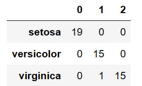
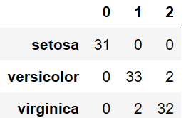

# Week - 5

```python
  import pandas as pd
  from sklearn.datasets import load_iris
  iris = load_iris()
  print(iris.keys())
  df = pd.DataFrame(iris['data'])
  print(df)
```

`output`
```
dict_keys(['data', 'target', 'frame', 'target_names', 'DESCR', 'feature_names', 'filename'])
       0    1    2    3
0    5.1  3.5  1.4  0.2
1    4.9  3.0  1.4  0.2
2    4.7  3.2  1.3  0.2
3    4.6  3.1  1.5  0.2
4    5.0  3.6  1.4  0.2
..   ...  ...  ...  ...
145  6.7  3.0  5.2  2.3
146  6.3  2.5  5.0  1.9
147  6.5  3.0  5.2  2.0
148  6.2  3.4  5.4  2.3
149  5.9  3.0  5.1  1.8

[150 rows x 4 columns]
```

```python
print(iris['target_names'])
print(iris['feature_names'])
print(iris['target'])
```

`output`

```
['setosa' 'versicolor' 'virginica']
['sepal length (cm)', 'sepal width (cm)', 'petal length (cm)', 'petal width (cm)']
[0 0 0 0 0 0 0 0 0 0 0 0 0 0 0 0 0 0 0 0 0 0 0 0 0 0 0 0 0 0 0 0 0 0 0 0 0
 0 0 0 0 0 0 0 0 0 0 0 0 0 1 1 1 1 1 1 1 1 1 1 1 1 1 1 1 1 1 1 1 1 1 1 1 1
 1 1 1 1 1 1 1 1 1 1 1 1 1 1 1 1 1 1 1 1 1 1 1 1 1 1 2 2 2 2 2 2 2 2 2 2 2
 2 2 2 2 2 2 2 2 2 2 2 2 2 2 2 2 2 2 2 2 2 2 2 2 2 2 2 2 2 2 2 2 2 2 2 2 2
 2 2]
```


```python
X = df
y = iris['target']
from sklearn.model_selection import train_test_split
X_train, X_test, y_train, y_test = train_test_split(X, y, test_size = 0.33, random_state = 42)
from sklearn.neighbors import KNeighborsClassifier
knn = KNeighborsClassifier(n_neighbors = 3)
knn.fit(X_train, y_train)
KNeighborsClassifier(algorithm = 'auto', leaf_size = 30, metric = 'minkowski', metric_params = None, n_jobs = None, n_neighbors = 3, p = 2, weights = 'uniform')
```
`output`

```
KNeighborsClassifier(n_neighbors=3)
```

```python
from sklearn.metrics import confusion_matrix
from sklearn.metrics import accuracy_score
from sklearn.metrics import classification_report

y_pred = knn.predict(X_test)
cm = confusion_matrix(y_test, y_pred)
print(cm)
cm = pd.DataFrame(data = cm, index = ['setosa', 'versicolor', 'virginica'])
cm
```

`output`

```
[[19  0  0]
 [ 0 15  0]
 [ 0  1 15]]
```



```python
print("Correction prediction : ", accuracy_score(y_test, y_pred))
print("Wrong prediction : ", (1-accuracy_score(y_test, y_pred)))
```

`output`

```
Correction prediction :  0.98
Wrong prediction :  0.020000000000000018
```

```python
y_testtrain = knn.predict(X_train)
cm1 = confusion_matrix(y_train, y_testtrain)
print(cm1)
cm1 = pd.DataFrame(data = cm1, index = ['setosa', 'versicolor', 'virginica'])
cm1

```

`output`

```
[[31  0  0]
 [ 0 33  2]
 [ 0  2 32]]
```




```python
from sklearn.tree import DecisionTreeClassifier
svc = DecisionTreeClassifier()
svc.fit(X_train, y_train)
y_p = svc.predict(X_test)
print(accuracy_score(y_p, y_test))
```

`output`

```
1.0
```

```python

```

`output`

```

```